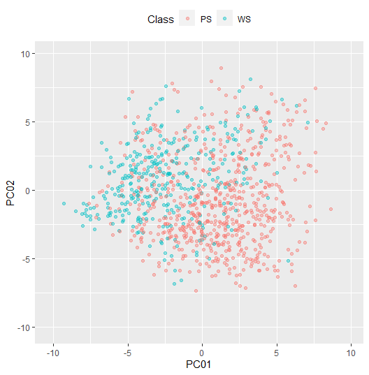
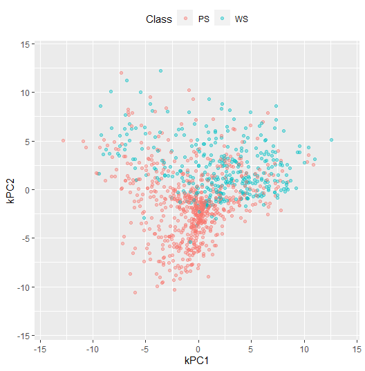
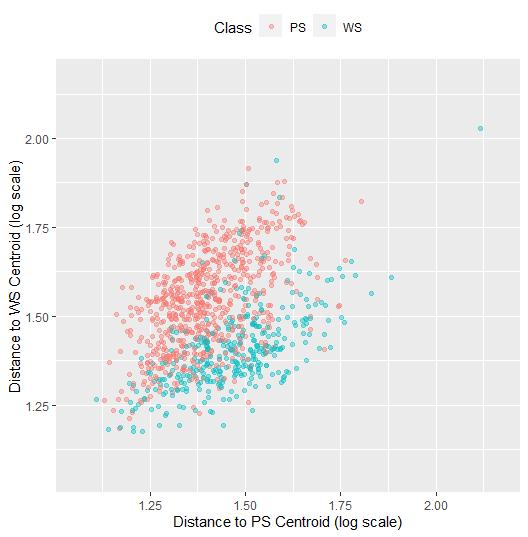

Niccolò Salvini
24/4/2020


# glimpse(Recipe)

[](http://cran.r-project.org/web/packages/recipes)

## Introduction

This tutorial comes from the
[RStudio 2017](https://rstudio.com/resources/webinars/creating-and-preprocessing-a-design-matrix-with-recipes/)
conference where the author of the package
[MaxKuhn](https://resources.rstudio.com/authors/max-kuhn) explains the
functionalities and the idea behind building the *recipes*. Those are
all the notes taken during the online lecture.

**warings**:: Something can have changed from the original 2017
presentation. I updated the syntax so that it matches the latest version
of the package and it is reusable. Below you find the major improvements
wrt what we are doing here.

|          **First** |     **Before** |
| -----------------: | -------------: |
|        `prepare()` |       `prep()` |
|            newdata |      new\_data |
| `all_predictors()` | `everything()` |

The idea is pretty simple: once you have to cook a dish you have to know
the *recipe*. Once you know the *recipe* which is basically a sequence
of simple steps, you can then perform the dish and serve it. If at some
point you understand that the dish is missing something, say some spicy,
you should not *undish* the dinner but simply go get the grocery at the
store and add the extraflavour. Still the recipe is consisten you are
not messing the ‘dressing’. From my perspective this is mainly good for
at **least 4 reasons**:

1.  it follows good statistical practice
2.  it keeps all the stuff well ordered
3.  it gives a solution toghether with the `parnsip` to gather all the
    different models into one common framework
4.  once you have done it for the first time it is just a matter of copy
    and paste

## R Model Formulas

``` r
data(Sacramento)

rec  = recipe(price ~ type + sqft, data = Sacramento)
rec = rec %>%  
  step_log(price) %>% 
  step_dummy(type)
rec
```

    ## Data Recipe
    ## 
    ## Inputs:
    ## 
    ##       role #variables
    ##    outcome          1
    ##  predictor          2
    ## 
    ## Operations:
    ## 
    ## Log transformation on price
    ## Dummy variables from type

Once you have initialized the `recipe` you can start adding steps to the
`recipe`: so if you want to take the original `recipe` and add a step
said to be `step_log()` and you simply put the variabile inside the
parentheses and that modifies the `recipe` including the step done (this
as it is said will add the logarithm to the variable price). Then say
that you want to dummyfy the varible ‘type’. You pipe-operate all the
previous recipe adding one more step. This decribes the preprocess
operations you want to have to you data, but again we are still not
doing any computation, we are specifying all the operations that we want
to perform. The recipe to serve our best dish.

## `prep()` preparation step

``` r
rec_trained = prep(rec, training = Sacramento, retain = T)
```

In the chunk above you are **preparing** the `recipe`. This preparing
can be see as the training/fitting the preprocess steps, but actually
you are not still from a computational pov doing it. What it does is
printing the steps, it helps you to keep track of what you are doing.
the *retain = T* take the dataset you give and when you estimate it
keeps that modified version on the training so that you do not have to
do it many more times.

## `bake()` baking step

Now going on with the analogy you cook the `recipe`, so we take the
`recipe` object that we created and then apply this `recipe` to the
dataset that we have. It is pretty like an apply method. The reason why
you can specify the dataset can be found in the fourth point of **least
4 reasons** I enounced before. Once you have specified the `recipe` you
can cook through the steps with any ingredients. Say you are cooking
chicken masala, you know the recipe beacuse you love indian food. Once
you have to make lamb masala, assuming that there is no indian chef
hearing, it is just a matter of coocking meat time.

``` r
design_mat = bake(rec_trained, new_data = Sacramento)
```

here you define the design matrix, so the set of all the predictors, but
we havent finished yet. For the moment we still didn’t encode any
variables, didn’t do any PCA (any sort of selection features) nor
discretized predictors with dynamic bins. What the `dplyr` syntax
actually allow us to do is to apply the step to a set of columns that
have in common a feature, the fact that they are numeric.

One other interesting feature is that you can decide before actually
performing operations how many PCAs you want, you might want to do
operation that actually are not still performed. really really rich set
of steps.

Another cool thing about the recipe is that is *cumulative* in the sense
that you can split the preprocess into parts so that you can be very
precise and narrow many different preprocess pipelines. Seebelow:

## second step preprocess

``` r
standardized = rec_trained %>% 
  step_center(all_numeric()) %>% 
  step_scale(all_numeric()) %>% 
  step_pca(all_numeric())

standardized = prep(standardized)
standardized
```

    ## Data Recipe
    ## 
    ## Inputs:
    ## 
    ##       role #variables
    ##    outcome          1
    ##  predictor          2
    ## 
    ## Training data contained 932 data points and no missing data.
    ## 
    ## Operations:
    ## 
    ## Log transformation on price [trained]
    ## Dummy variables from type [trained]
    ## Centering for sqft, price, ... [trained]
    ## Scaling for sqft, price, ... [trained]
    ## PCA extraction with sqft, price, type_Multi_Family, type_Residential [trained]

You can just keep adding steps to it. Here you added to the previous
`recipe` that, as we know, logged the price and encode the dummy
variable. It actually does not make sense this tranformation for this
variables but it is just to give a taste of what are the potentialities.
If you didn’t set the *retain = T* then when you are refitting in the
standardized you are going to loose work, so make sure you do not forget
it. Those below are some of the steps you can perform, this presentation
come from **2017** so the mantainers will for sure have refined it.


econding: dummy variables, discretization, date feature: you can model
holidays (purrr it before) imputation: all the main imputation

Once you have all set up you can call the fucntion that wraps all
toghether like in the python framework:

``` r
lin_reg.recipe = function(rec,data) {
  trained = prep(rec, training = data)
  lm.fit(x= bake(trained, new_data = data, all_predictors()),
         y =bake(trained, new_data = data, all_outcomes()))
  
}
```

## A Practical Example

[Kuhn and Johnson](http://appliedpredictivemodeling.com) (2013) analyze
a data set where thousands of cells are determined to be well-segmented
(WS) or poorly segmented (PS) based on 58 image features. We would like
to make predictions of the segmentation quality based on these features.

``` r
library(dplyr) 
library(caret)

data("segmentationData")
seg_train <- segmentationData %>%
  filter(Case == "Train") %>%
  select(-Case, -Cell) 
seg_test <- segmentationData %>% 
  filter(Case =="Test") %>%
  select(-Case, -Cell)
```

## A Simple Recipe

``` r
rec <- recipe(Class ~ ., data = seg_train) 
basic <- rec %>%# Correct some predictors for skewness
  step_YeoJohnson(all_predictors()) %>% # Standardize the values
  step_center(all_predictors()) %>% 
  step_scale(all_predictors()) #Estimate the transformation and standardization parameters 
basic <- prep(basic, training = seg_train, verbose = FALSE, retain = TRUE)
```

## Principal Component Analysis

``` r
pca <- basic %>% 
  step_pca(all_predictors(),threshold =.9)
summary(pca)
```

    ## # A tibble: 59 x 4
    ##    variable                type    role      source  
    ##    <chr>                   <chr>   <chr>     <chr>   
    ##  1 AngleCh1                numeric predictor original
    ##  2 AreaCh1                 numeric predictor original
    ##  3 AvgIntenCh1             numeric predictor original
    ##  4 AvgIntenCh2             numeric predictor original
    ##  5 AvgIntenCh3             numeric predictor original
    ##  6 AvgIntenCh4             numeric predictor original
    ##  7 ConvexHullAreaRatioCh1  numeric predictor original
    ##  8 ConvexHullPerimRatioCh1 numeric predictor original
    ##  9 DiffIntenDensityCh1     numeric predictor original
    ## 10 DiffIntenDensityCh3     numeric predictor original
    ## # ... with 49 more rows

## Principal Component Analysis

``` r
pca <- prep(pca) 
summary(pca) 
```

    ## # A tibble: 16 x 4
    ##    variable type    role      source  
    ##    <chr>    <chr>   <chr>     <chr>   
    ##  1 Class    nominal outcome   original
    ##  2 PC01     numeric predictor derived 
    ##  3 PC02     numeric predictor derived 
    ##  4 PC03     numeric predictor derived 
    ##  5 PC04     numeric predictor derived 
    ##  6 PC05     numeric predictor derived 
    ##  7 PC06     numeric predictor derived 
    ##  8 PC07     numeric predictor derived 
    ##  9 PC08     numeric predictor derived 
    ## 10 PC09     numeric predictor derived 
    ## 11 PC10     numeric predictor derived 
    ## 12 PC11     numeric predictor derived 
    ## 13 PC12     numeric predictor derived 
    ## 14 PC13     numeric predictor derived 
    ## 15 PC14     numeric predictor derived 
    ## 16 PC15     numeric predictor derived

``` r
pca <- bake(pca, new_data = seg_test, everything())
```

## Principal Component Analysis

<p align="center">

``` r
pca[1:4, 1:8]
ggplot(pca, aes(x =PC01, y = PC02, color = Class)) + 
  geom_point(alpha = .4)
```

</p>

## Principal Component Analysis

<p align="center">



</p>

## Kernel Principal Component Analysis

``` r
kern_pca <- basic %>% step_kpca(all_predictors(), num = 2,
                                options = list(kernel = "rbfdot", kpar = list(sigma = 0.05))) 
```

    ## `step_kpca()` is deprecated in favor of either `step_kpca_rbf()` or `step_kpca_poly()`. It will be removed in future versions.

``` r
kern_pca<- prep(kern_pca)
```

    ## 2020-05-22 18:48:03: Calculating kernel PCA

    ## 2020-05-22 18:48:06: Trying to calculate reverse

    ## 2020-05-22 18:48:07: DONE

``` r
kern_pca <- bake(kern_pca, new_data = seg_test, everything())
```

## Kernel Principal Component Analysis

<p align="center">



</p>

## Distance to Each Class Centroid

``` r
dist_to_classes <- basic %>%
step_classdist(all_predictors(), class = "Class") %>% # Take log of the
  step_log(starts_with("classdist")) 

dist_to_classes<- prep(dist_to_classes, verbose = FALSE) # All variables are retained
dist_to_classes <-bake(dist_to_classes, new_data = seg_test, matches("[Cc]lass"))
dist_to_classes
```

    ## # A tibble: 1,010 x 3
    ##    Class classdist_PS classdist_WS
    ##    <fct>        <dbl>        <dbl>
    ##  1 PS            1.53         1.74
    ##  2 PS            1.35         1.46
    ##  3 WS            1.71         1.53
    ##  4 WS            1.75         1.61
    ##  5 PS            1.47         1.65
    ##  6 WS            1.48         1.47
    ##  7 WS            1.49         1.55
    ##  8 WS            1.55         1.40
    ##  9 PS            1.54         1.71
    ## 10 PS            1.55         1.57
    ## # ... with 1,000 more rows

## Distance to Each Class

<p align="center">



</p>
