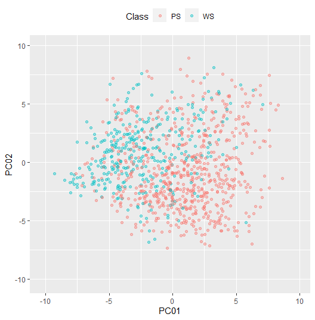
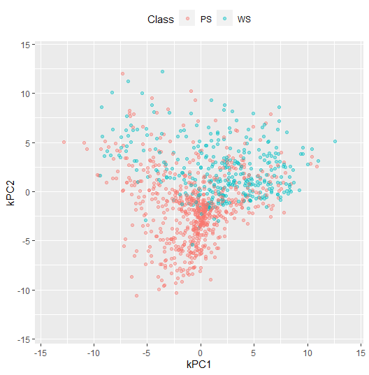
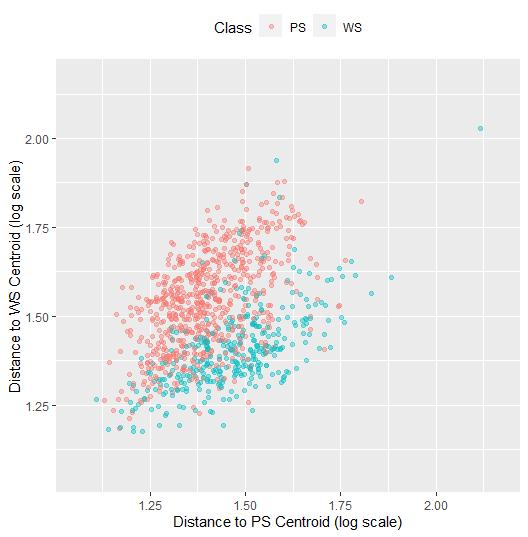

recipe tutorial
================

### tutorial

this tutorial come from the
[RStudio 2017](https://rstudio.com/resources/webinars/creating-and-preprocessing-a-design-matrix-with-recipes/)
conference where the author of the package
[Kuhn](https://resources.rstudio.com/authors/max-kuhn) explains the
functionalisties and the idea behind building the **recipe **

The idea is pretty simple once you have to cook a dish you have to know
the recipe. Once yoi know the recipe which is basicallu a sequence of
simple steps you can then perform the dish and serve it. If at some
point you understand that the dish is missing something, say some spicy,
you should not *undish* the dinner but simply go get the grocery at the
store and add the extraflavour in the right spot, without say messing
the impiattamento. This is mainly good for at **least 4 reasons** 1. it
follows good statistical practice 1. it keeps all the stuff well ordered
1. it gives a solution toghether with the *parnsip* to gather all the
different models into one common framework 1. once you have done it for
the first time it is just a matter of copy and paste

``` r
library(recipes)
library(tidyverse)
library(caret)
```

``` r
data(Sacramento)

rec  = recipe(price ~ type + sqft, data = Sacramento)
rec = rec %>%  
  step_log(price) %>% 
  step_dummy(type)

rec
```

    ## Data Recipe
    ## 
    ## Inputs:
    ## 
    ##       role #variables
    ##    outcome          1
    ##  predictor          2
    ## 
    ## Operations:
    ## 
    ## Log transformation on price
    ## Dummy variables from type

one you have initialized the recipe you can start add steps to the
recipe: so if you want to take the original recipe and add a step said
to be *step\_log* and you simply put the variabile inside the
parentheses and that modifies the recipe including the step done (this
as it is said will add the logarithm to the variable price) then say
that you want to dummyfy the varible type. You pipe operate all the
previous recipe and you add simply one other step. and this decribes the
preprocess operations you want to have, but again all it is doing is to
specify all the operation that we want to perform, they are no actually
do anything for the moment.

``` r
rec_trained = prep(rec, training = Sacramento, retain = T)
```

then in the chunk above you are **preparing** the recipe as it is said,
this preparing can be see as the training fitting the preprocess step
but actually not computationallu doing it. It prints the steps, it helps
you to keep track of what you are doing. the *retain = T* take the
dataset tahti give it and when you estimate keep that modified verison
on the training so that you do not have to do it many times.

``` r
design_mat = bake(rec_trained, new_data = Sacramento)
```

now going on with the analogy you cook the recipe, so we take the object
that we created and then apply this recipe to the dataset that I have.
It like an apply method. the reason why you can specify the dataset is
that the \[4^{th}\] I said before, once you specify the recipe you can
cook pass throught the steps any ingredients that you want. **So this is
the full idea behind** the rest are all the features of the package, so
all the steps that you can add to your dataset preprocess and so on.

this is all about dplyr sintax. For the moment we still didnt encode any
variables, didnt do any PCA (any sort of selection features) nor
discretized predictors with dynamic bins. What the dplyr syntax actually
permits us to do is to apply the step to a set of columns, instead for a
single one.

One other interesting feature is that you can decide before actually
perfoming operations how many pca’s you want, you might want to do
operation that actually are not still performed. really really rich set
of steps.

One cool thing about the recipe is taht is cumulative so that you can
split the preprocess into parts so that you can be very precise. see
below:

``` r
standardized = rec_trained %>% 
  step_center(all_numeric()) %>% 
  step_scale(all_numeric()) %>% 
  step_pca(all_numeric())

standardized = prep(standardized)
standardized
```

    ## Data Recipe
    ## 
    ## Inputs:
    ## 
    ##       role #variables
    ##    outcome          1
    ##  predictor          2
    ## 
    ## Training data contained 932 data points and no missing data.
    ## 
    ## Operations:
    ## 
    ## Log transformation on price [trained]
    ## Dummy variables from type [trained]
    ## Centering for sqft, price, ... [trained]
    ## Scaling for sqft, price, ... [trained]
    ## PCA extraction with sqft, price, type_Multi_Family, type_Residential [trained]

you can just keep add steps to it, so you added to the first recipe that
logged the price and creates the dummy variable, you do not do to redo
anything. it does not make sense for this varibales but it is just to
give a test of what you can do. If you didnt *retain = T* then when you
are refitting in the standardized you are going to loose work, so make
sure you do not forget it. those below are some of the steps you can
perform, this presentation come from **2017** so the mantainers will for
sure have updated it with the latest technologies


econding: dummy variables, discretization, date feature: you can model
holidays (purrr it before) imputation: all the main imputation

Once you have all set up you can call the fucntion that wraps all
toghether like in the python framework:

``` r
lin_reg.recipe = function(rec,data) {
  trained = prepare(rec, training = data)
  lm.fit(x= bake(trained, newdara = data, all_predictors()),
         y =bake(trained, newdara = data, all_outcomes()))
  
}
```

## An Example

[Kuhn and Johnson](http://appliedpredictivemodeling.com) (2013) analyze
a data set where thousands of cells are determined to be well-segmented
(WS) or poorly segmented (PS) based on 58 image features. We would like
to make predictions of the segmentation quality based on these features.

``` r
library(dplyr)
library(caret)
data("segmentationData")
seg_train <- segmentationData %>% 
  filter(Case == "Train") %>% 
  select(-Case, -Cell)
seg_test  <- segmentationData %>% 
  filter(Case == "Test")  %>% 
  select(-Case, -Cell)
```

## A Simple Recipe

``` r
rec <- recipe(Class  ~ ., data = seg_train)
basic <- rec %>%
  # Correct some predictors for skewness
  step_YeoJohnson(all_predictors()) %>%
  # Standardize the values
  step_center(all_predictors()) %>%
  step_scale(all_predictors())
# Estimate the transformation and standardization parameters 
basic <- prep(basic, training = seg_train, verbose = FALSE, retain = TRUE)  
basic
```

    ## Data Recipe
    ## 
    ## Inputs:
    ## 
    ##       role #variables
    ##    outcome          1
    ##  predictor         58
    ## 
    ## Training data contained 1009 data points and no missing data.
    ## 
    ## Operations:
    ## 
    ## Yeo-Johnson transformation on AngleCh1, AreaCh1, ... [trained]
    ## Centering for AngleCh1, AreaCh1, AvgIntenCh1, ... [trained]
    ## Scaling for AngleCh1, AreaCh1, AvgIntenCh1, ... [trained]

## Principal Component Analysis

``` r
pca <- basic %>% step_pca(all_predictors(), threshold = .9)
summary(pca)
```

    ## # A tibble: 59 x 4
    ##    variable                type    role      source  
    ##    <chr>                   <chr>   <chr>     <chr>   
    ##  1 AngleCh1                numeric predictor original
    ##  2 AreaCh1                 numeric predictor original
    ##  3 AvgIntenCh1             numeric predictor original
    ##  4 AvgIntenCh2             numeric predictor original
    ##  5 AvgIntenCh3             numeric predictor original
    ##  6 AvgIntenCh4             numeric predictor original
    ##  7 ConvexHullAreaRatioCh1  numeric predictor original
    ##  8 ConvexHullPerimRatioCh1 numeric predictor original
    ##  9 DiffIntenDensityCh1     numeric predictor original
    ## 10 DiffIntenDensityCh3     numeric predictor original
    ## # ... with 49 more rows

## Principal Component Analysis

``` r
pca <- prep(pca)
summary(pca)
```

    ## # A tibble: 16 x 4
    ##    variable type    role      source  
    ##    <chr>    <chr>   <chr>     <chr>   
    ##  1 Class    nominal outcome   original
    ##  2 PC01     numeric predictor derived 
    ##  3 PC02     numeric predictor derived 
    ##  4 PC03     numeric predictor derived 
    ##  5 PC04     numeric predictor derived 
    ##  6 PC05     numeric predictor derived 
    ##  7 PC06     numeric predictor derived 
    ##  8 PC07     numeric predictor derived 
    ##  9 PC08     numeric predictor derived 
    ## 10 PC09     numeric predictor derived 
    ## 11 PC10     numeric predictor derived 
    ## 12 PC11     numeric predictor derived 
    ## 13 PC12     numeric predictor derived 
    ## 14 PC13     numeric predictor derived 
    ## 15 PC14     numeric predictor derived 
    ## 16 PC15     numeric predictor derived

``` r
pca <- bake(pca, new_data = seg_test, everything())
pca
```

    ## # A tibble: 1,010 x 16
    ##    Class  PC01   PC02   PC03   PC04  PC05   PC06   PC07    PC08    PC09    PC10
    ##    <fct> <dbl>  <dbl>  <dbl>  <dbl> <dbl>  <dbl>  <dbl>   <dbl>   <dbl>   <dbl>
    ##  1 PS     4.86 -5.85  -0.891 -4.13  1.84  -2.29  -3.88  -1.27   -1.15    0.679 
    ##  2 PS     3.28 -1.51   0.353 -2.24  0.441 -0.911  0.800  0.0709 -1.33    0.279 
    ##  3 WS    -7.03 -1.77  -2.42  -0.652 3.22  -0.212  0.118  0.487   1.33    0.0787
    ##  4 WS    -6.96 -2.08  -2.89  -1.79  3.20  -0.845 -0.204  1.02    0.842   0.447 
    ##  5 PS     6.52 -3.77  -0.924 -2.61  2.49  -1.50  -1.63   1.64   -1.71    1.56  
    ##  6 WS     2.87  1.66   1.75  -5.41  0.324  1.40  -0.198  1.73   -0.353  -1.12  
    ##  7 WS     2.72  0.433 -1.05  -5.45  1.18  -0.136  0.441  2.15   -1.79   -1.87  
    ##  8 WS    -3.01  1.94   2.68  -0.409 3.55  -1.60  -0.189 -2.49   -0.472   1.12  
    ##  9 PS     6.91 -3.83  -1.57  -2.71  1.21  -1.16  -0.766  2.59   -0.0243  1.35  
    ## 10 PS    -2.28 -3.53  -1.78  -3.30  2.62  -0.890  0.829  2.18   -1.41   -2.25  
    ## # ... with 1,000 more rows, and 5 more variables: PC11 <dbl>, PC12 <dbl>,
    ## #   PC13 <dbl>, PC14 <dbl>, PC15 <dbl>

## Principal Component Analysis

``` r
pca[1:4, 1:8]
```

    ## # A tibble: 4 x 8
    ##   Class  PC01  PC02   PC03   PC04  PC05   PC06   PC07
    ##   <fct> <dbl> <dbl>  <dbl>  <dbl> <dbl>  <dbl>  <dbl>
    ## 1 PS     4.86 -5.85 -0.891 -4.13  1.84  -2.29  -3.88 
    ## 2 PS     3.28 -1.51  0.353 -2.24  0.441 -0.911  0.800
    ## 3 WS    -7.03 -1.77 -2.42  -0.652 3.22  -0.212  0.118
    ## 4 WS    -6.96 -2.08 -2.89  -1.79  3.20  -0.845 -0.204

``` r
ggplot(pca, aes(x = PC01, y = PC02, color = Class)) + geom_point(alpha = .4)
```

## Principal Component Analysis

<!-- -->

## Kernel Principal Component Analysis

``` r
library(dimRed)
```

    ## Warning: package 'dimRed' was built under R version 3.6.3

    ## Loading required package: DRR

    ## Warning: package 'DRR' was built under R version 3.6.3

    ## Loading required package: kernlab

    ## 
    ## Attaching package: 'kernlab'

    ## The following object is masked from 'package:purrr':
    ## 
    ##     cross

    ## The following object is masked from 'package:ggplot2':
    ## 
    ##     alpha

    ## Loading required package: CVST

    ## Warning: package 'CVST' was built under R version 3.6.3

    ## Loading required package: Matrix

    ## 
    ## Attaching package: 'Matrix'

    ## The following objects are masked from 'package:tidyr':
    ## 
    ##     expand, pack, unpack

    ## 
    ## Attaching package: 'dimRed'

    ## The following object is masked from 'package:stats':
    ## 
    ##     embed

    ## The following object is masked from 'package:base':
    ## 
    ##     as.data.frame

``` r
kern_pca <- basic %>% 
  step_kpca(all_predictors(), num = 2, 
            options = list(kernel = "rbfdot", 
                           kpar = list(sigma = 0.05)))
```

    ## `step_kpca()` is deprecated in favor of either `step_kpca_rbf()` or `step_kpca_poly()`. It will be removed in future versions.

``` r
kern_pca <- prep(kern_pca)
```

    ## 2020-04-24 02:26:36: Calculating kernel PCA

    ## 2020-04-24 02:26:38: Trying to calculate reverse

    ## 2020-04-24 02:26:39: DONE

``` r
kern_pca <- bake(kern_pca, new_data = seg_test, everything())
```

## Kernel Principal Component Analysis

<!-- -->

## Distance to Each Class Centroid

``` r
dist_to_classes <- basic %>% 
  step_classdist(all_predictors(), class = "Class") %>%
  # Take log of the new distance features
  step_log(starts_with("classdist"))
dist_to_classes <- prep(dist_to_classes, verbose = FALSE)
# All variables are retained plus an additional one for each class
dist_to_classes <- bake(dist_to_classes, new_data = seg_test, matches("[Cc]lass"))
dist_to_classes
```

    ## # A tibble: 1,010 x 3
    ##    Class classdist_PS classdist_WS
    ##    <fct>        <dbl>        <dbl>
    ##  1 PS            1.53         1.74
    ##  2 PS            1.35         1.46
    ##  3 WS            1.71         1.53
    ##  4 WS            1.75         1.61
    ##  5 PS            1.47         1.65
    ##  6 WS            1.48         1.47
    ##  7 WS            1.49         1.55
    ##  8 WS            1.55         1.40
    ##  9 PS            1.54         1.71
    ## 10 PS            1.55         1.57
    ## # ... with 1,000 more rows

## Distance to Each Class

<!-- -->
